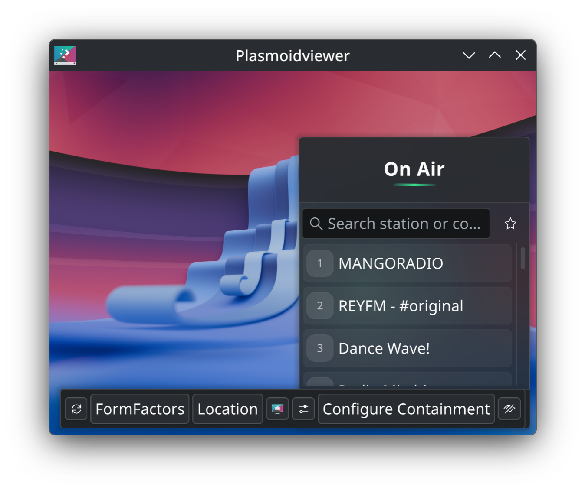

# On Air 📻

**A beautiful internet radio widget for KDE Plasma 6** — worldwide station search, one-click track downloads, offline library, media keys, and a 2026-grade UI.



## Features

- 🎨 **Modern 2026 UI** — animated aurora backdrop, spinning vinyl fallback art, cascading list animations, LIVE & bitrate pills, pulsing equalizers, emerald accent design
- 🌍 **Worldwide station search** — type a country name ("Finland") or genre ("jazz") and discover stations from the radio-browser.info catalogue (~50 000 stations). Click to preview, ⭐ to keep
- 🎵 **Live track info** — artist & title from ICY metadata or the Qt FFmpeg backend, with album art lookup (iTunes/Deezer)
- ⏺ **Stream recording** — one click records the station you're listening to as a bit-exact copy (no re-encoding), straight into your library, with a track-list sidecar. **Scheduled recordings** capture a show once, daily or weekly — even while nothing is playing
- ⬇ **One-click track downloads** — grab the song that's playing right now at maximum quality (original audio, no re-encoding) via `yt-dlp`. Optional AI title cleanup via Claude CLI
- 📚 **My Music** — built-in offline library page for your downloaded tracks and recordings
- 🕐 **Recently played history** — the last 30 tracks with timestamps; download a song you missed half an hour ago
- ⏰ **Sleep timer** with progress ring and gentle 30-second fade-out
- 🎹 **MPRIS integration** — media keys and the Plasma media controls just work
- 🔊 Auto-bitrate upgrade, scroll-wheel volume, keyboard navigation (`/`, arrows, Space, M, Esc), mini-equalizer on the panel icon

## Requirements

- **KDE Plasma 6** (any distribution: Kubuntu, Fedora KDE, openSUSE, Arch/CachyOS, Manjaro…)
- Qt 6 Multimedia with the FFmpeg backend (default on most distros)

Optional (features degrade gracefully without them):

| Package | Enables |
|---|---|
| `python-requests` | ICY track titles on streams the Qt backend can't read |
| `python-dbus`, `python-gobject` | MPRIS media keys / media controls |
| `ffmpeg` | Stream recording (instant + scheduled) |
| `yt-dlp` + `ffmpeg` | Track downloads |
| `inotify-tools` | Zero-polling MPRIS command channel |
| `claude` (Claude Code CLI) | Optional AI cleanup of messy radio titles |

## Install

**From KDE Store (recommended):** right-click your desktop or panel → *Add Widgets* → *Get New Widgets* → search **On Air**, or get it from the [KDE Store page](https://store.kde.org/p/2364623).

**Manual:**
```bash
kpackagetool6 --type Plasma/Applet --install package
# or from the release file:
kpackagetool6 --type Plasma/Applet --install on-air-2026.5.1.plasmoid
```

## Usage tips

- **Click** a search result to preview it — **⭐** adds it to your stations & favorites
- **Hover** a station row for the ⭐ and 🗑 buttons (removal asks twice — no accidents)
- **Scroll** on the volume button or the panel icon to change volume
- The **⬇ button** on the now-playing page downloads the current track to `~/Music/OnAir`
- The **folder button** in the footer opens **My Music** — your offline library and play history

## Recording

- Press the **⏺ REC button** on the now-playing page to record the station you're listening to. Press again to stop. The recording is a bit-exact stream copy (original quality) saved to `~/Music/OnAir`, with a `.tracks.txt` file listing the songs and their timestamps.
- **Scheduled recordings** live on the **My Music page** (the stopwatch button): pick a station, a start time, a duration and *once / daily / weekly* — the widget records it in the background, even if you're not listening. A red dot on the panel icon shows when a recording is running.
- One recording runs at a time, and every recording has a hard length cap (Settings → *Recording*, default 3 hours) so a forgotten REC can't fill your disk.
- **Format** (Settings → *Recording*): *Original stream* (bit-exact copy — recommended; radio streams are already compressed, so this IS the maximum quality), *MP3* (high-quality re-encode for maximum device compatibility) or *WAV* (uncompressed PCM for editing — very large files, no quality gain).
- **Personal use only.** Recording internet radio for your own, non-commercial use is a recognised private-copy exception in the EU (Directive 2001/29/EC art. 5(2)(b)) and many other jurisdictions, and these public streams carry no copy protection that would be circumvented. Do **not** share, upload or commercially exploit recordings — that is outside the exception. You are responsible for complying with the laws of your country.

## Credits & License

**On Air** (2026 edition) by **Egon Greenberg** — new UI, bug fixes, worldwide search, downloads, offline library, MPRIS/metadata engine.

Based on [Advanced Radio Player](https://store.kde.org/p/1972502) by **Yuri Saurov**.

Licensed under **LGPL-2.0-or-later**. See [LICENSE](LICENSE).

*Note: the track download and stream recording features are tools provided as-is, intended for personal use only; users are responsible for complying with local laws and the terms of the services they use.*
